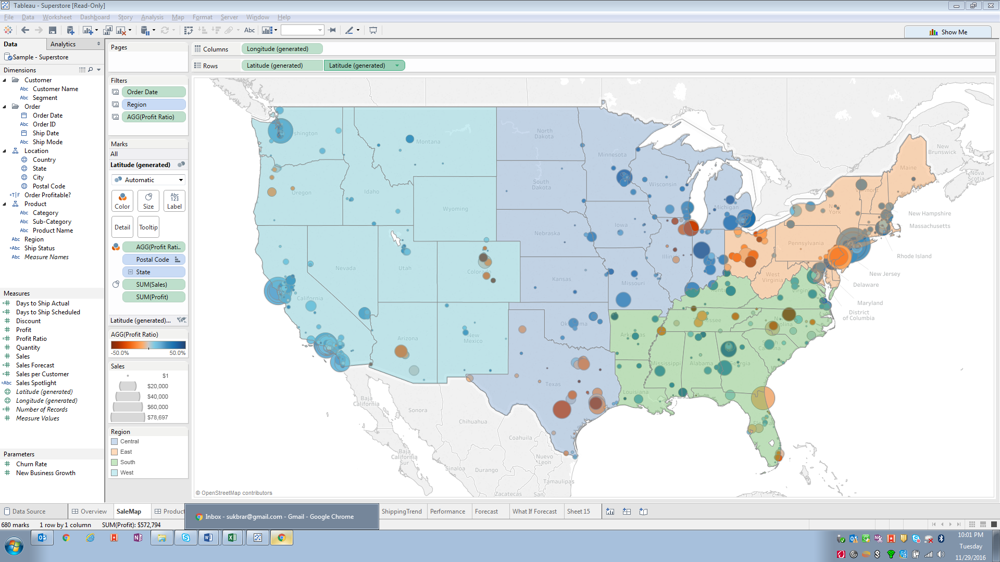

# Peer-graded Assignment: Dual Layer Maps
## by: César Robles

### Introduction:
Your company has tasked you with creating a dual layer map.  The map should show total profit by postal code, colorized by profit ratio, and sized by total sales.  Furthermore this map should also show Regions across the United States.

### Files:
[Sales-Superstore-Dataset.xlsx](./files/Sales-Superstore-Dataset.xslx)

### Review criteria:
The variables you will need to use to complete the task are:

* Order Date
* Region
* Profit Ratio
* Postal Code
* State
* Sales
* Profit

#### Here is what you are trying to replicate:

[Dual-Layers-Map]()
