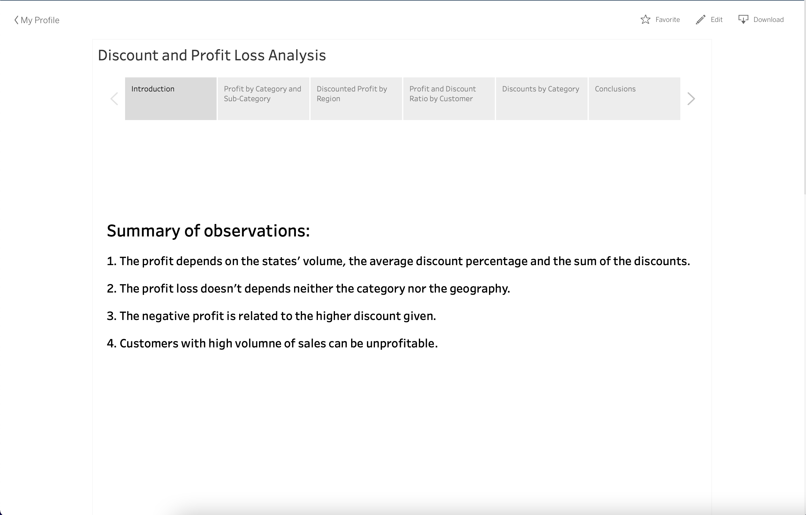

# Peer-graded Assignment: Part 4: Story Points Presentation

## Instructions

Please review the project brief, personas, and the work you have done to this point for parts 1-3.
* [PGA_Create_a_Design_Checklist](../../Week1/Peer-graded_Assignment_Create_a_Design_Checklist.md)
* [PGA_Creating_a_Dashboard](../../Week3/PGA_Creating_a_Dashboard.md)

Now, you will create the final deliverable for Sylvia to present your analysis to company stakeholders. Sylvia will ultimately be presenting these findings both on handouts as a single-frame visualization (optional activity), and in a multi-slide Story Points presentation to board members. The single-frame visualization will be included on hand-outs in the board meeting.

**Use Story Points to Create an Annotated Presentation...**
* That Sylvia will use to present your findings and recommendations to the board. The story must consist of at least three story points and must explicitly answer the business question(s) in the project brief, specifically: are discounted orders more or less profitable than non-discounted orders?
* Please reflect the specific needs of this audience in your design choices, and write a brief explanation of why you made the design choices you did.

## Solution:

[PGS Story Points Presentation](https://public.tableau.com/profile/cesar.robles#!/vizhome/PGA_Story_Points_Presentation/DiscountandProfitLossAnalysis)
